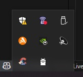

# 💬 Teste Imagine Software - Chat Cliente com Ollama

Este projeto é um teste técnico realizado para uma vaga na Imagine Software. Ele demonstra a criação de um **Chat Cliente** capaz de interagir com o modelo de linguagem local **Ollama** e, quando necessário, acessar uma **API externa** através de um servidor **MCP (Master Control Program)**.

## 🎯 Objetivo do Teste

O principal requisito do teste era desenvolver um sistema de chat onde o modelo de IA pudesse:

1.  Responder perguntas diretamente (conhecimento geral).
2.  Delegar a requisição a um serviço externo, passando pela camada do servidor MCP, para obter informações específicas.

A API externa utilizada neste projeto como exemplo é a **`get_server_time`**.

## ⚙️ Tecnologias e Dependências

### 💻 Stack Principal

* **Linguagem:** C#
* **Framework:** .NET 10
* **Comunicação:** API / JSON
* **Ambiente de Desenvolvimento:** VS Code

### 🧠 Modelo de IA

* **Plataforma:** [Ollama](https://ollama.com/) (Instalado localmente)
* **Modelo Utilizado:** `llama3.2:3b`
    > *Nota: Este modelo foi escolhido por fornecer o melhor equilíbrio entre desempenho e requisitos computacionais para o ambiente de desenvolvimento.*

## 🚀 Como Rodar o Projeto

### Pré-requisitos

Para rodar o projeto, você deve ter os seguintes itens instalados e configurados:

1.  **Ollama:** É essencial ter o Ollama instalado e rodando em sua máquina.
    * **Link para Download:** [https://ollama.com/download/windows](https://ollama.com/download/windows)



2.  **VS Code Extensions:**
    * [.NET Install Tool](https://marketplace.visualstudio.com/items?itemName=ms-dotnettools.vscode-dotnet-sdk)
    * [C#](https://marketplace.visualstudio.com/items?itemName=ms-dotnettools.csharp)
    * [C# Dev Kit](https://marketplace.visualstudio.com/items?itemName=ms-dotnettools.csdevkit)

---

### 1. Preparação Inicial

1.  **Clone o Repositório:**
    ```bash
    git clone [https://github.com/OtavioGrassi/Teste-Imagine-Software-Ollama](https://github.com/OtavioGrassi/Teste-Imagine-Software-Ollama)
    ```

2.  **Acesse a Pasta Raiz do Projeto:**
    ```bash
    cd Teste-Imagine-Software-Ollama
    ```

3.  **Restaure as Dependências:**
    ```bash
    dotnet restore
    ```

### 2. Inicializar o Servidor MCP

O servidor MCP precisa estar ativo para que o Chat Cliente possa acessá-lo.

1.  **Acesse a Pasta do Servidor:**
    ```bash
    cd McpServer
    ```

2.  **Inicie o Servidor:**
    ```bash
    dotnet run
    ```
    > *O servidor estará ativo e pronto para receber requisições, incluindo chamadas para a API `get_server_time`.*

### 3. Inicializar o Chat Cliente

Com o servidor rodando, abra um **novo terminal** para iniciar o chat.

1.  **Acesse a Pasta do Chat Cliente:**
    (Se você ainda estiver na pasta `McpServer`, volte e acesse a do cliente)
    ```bash
    cd .. # Volta para a pasta raiz
    cd ChatCLient
    ```

2.  **Inicie o Chat:**
    ```bash
    dotnet run
    ```

---

## 💡 Como Usar

O chat estará agora inicializado. Você pode interagir com a IA da seguinte forma:

1.  **Perguntas Gerais:** A IA responderá com seu conhecimento interno.
    * *Exemplo: "Qual a capital do Brasil?"*
2.  **Perguntas de API:** A IA reconhecerá a necessidade de obter informações em tempo real e delegará a requisição ao Servidor MCP.
    * *Exemplo: "Que horas são?"*


**Espero que tenham gostado!**